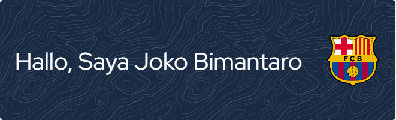

## Hi Semua 👋

Saya Joko Bimantaro, mahasiswa Politeknik Negeri Tanah Laut dari program studi Teknologi Informasi. Saya memiliki minat besar dalam dunia teknologi dan olahraga. Ketertarikan saya pada bidang teknologi sudah dimulai sejak usia 16 tahun, dan sebelumnya saya pernah bercita-cita menjadi seorang atlet sepak bola.

<picture>
  <source media="(prefers-color-scheme: dark)" srcset="https://raw.githubusercontent.com/jokobim12/jokobim12/output/pacman-contribution-graph-dark.svg">
  <source media="(prefers-color-scheme: light)" srcset="https://raw.githubusercontent.com/jokobim12/jokobim12/output/pacman-contribution-graph.svg">
  
</picture>

### Skil

### Sosial Media

  
  
  
  
  
  
  

### Statistik Github

<!--
**jokobim12/jokobim12** is a ✨ _special_ ✨ repository because its `README.md` (this file) appears on your GitHub profile.

Here are some ideas to get you started:

- 🔭 I’m currently working on ...
- 🌱 I’m currently learning ...
- 👯 I’m looking to collaborate on ...
- 🤔 I’m looking for help with ...
- 💬 Ask me about ...
- 📫 How to reach me: ...
- 😄 Pronouns: ...
- ⚡ Fun fact: ...
-->
